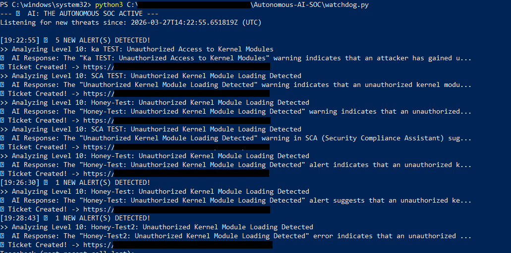
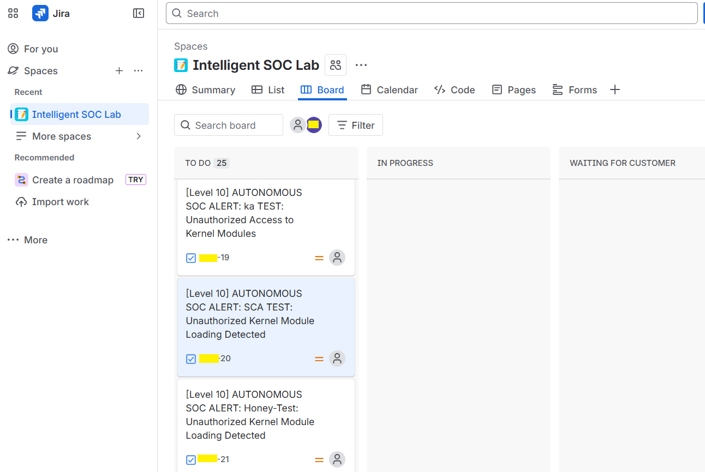

# AI: The Autonomous SOC 🛡️🤖

**AI: The Autonomous SOC** is an intelligent, end-to-end security automation pipeline. It bridges the gap between raw security telemetry and actionable incident response by using Local LLMs to analyze threats and automatically manage the ticketing lifecycle.

The system monitors a [Wazuh Indexer](https://wazuh.com/) for high-priority Security Configuration Assessment (SCA) failures, uses **Ollama (Llama 3)** to perform an automated risk analysis, and generates detailed **Jira tickets** with remediation steps.

## 🚀 Key Features
* **Real-time Threat Monitoring:** Continuously polls the Wazuh Indexer for Level 7+ security events.
* **Autonomous AI Triage:** Leverages Llama 3 to translate technical vulnerabilities into plain-English risk assessments.
* **Automated Incident Management:** Automatically creates and populates Jira tickets, reducing "Mean Time to Respond" (MTTR).
* **Zero-Trust Credential Management:** Uses environment variables (`.env`) to ensure sensitive API tokens and passwords never leave your local environment.

## 🛠️ Tech Stack
* **SIEM:** [Wazuh](https://wazuh.com/) (XDR/SIEM)
* **AI Engine:** [Ollama](https://ollama.com/) (Running Llama 3)
* **Ticketing:** [Jira Cloud](https://www.atlassian.com/software/jira)
* **Language:** Python 3.10+
* **Libraries:** `requests`, `ollama-python`, `jira`, `python-dotenv`

## 📋 Prerequisites
Before running the watchdog, ensure you have the following installed:

1.  **Python 3.10+**
2.  **Ollama:** [Download here](https://ollama.com/download) and pull the Llama3 model:
    ```bash
    ollama pull llama3
    ```
3.  **Wazuh Indexer:** A running instance (accessible via HTTPS).
4.  **Jira Cloud:** An active project and an [Atlassian API Token](https://id.atlassian.com/manage-profile/security/api-tokens).

## ⚙️ Installation & Setup

1.  **Clone the Repository:**
    ```bash
    git clone https://github.com/kavanaas-cybersecurity/AI-The-Autonomous-SOC.git
cd AI-The-Autonomous-SOC
    ```

2.  **Install Dependencies:**
    ```bash
    pip install -r requirements.txt
    ```

3.  **Configure Environment Variables:**
    Create a `.env` file in the root directory and add your credentials:
    ```text
    WAZUH_USER=admin
    WAZUH_PASS=YourSecretPassword
    INDEXER_URL=https://localhost:9200
    JIRA_SERVER=[https://your-domain.atlassian.net](https://your-domain.atlassian.net)
    JIRA_EMAIL=your-email@example.com
    JIRA_API_TOKEN=your_jira_api_token
    JIRA_PROJECT_KEY=PROJ
    ```

## 🏃 How to Run
1.  Ensure **Ollama** is running in the background.
2.  Start the Autonomous SOC Watchdog:
    ```bash
    python watchdog.py
    ```

## 🧪 How to Test (Simulation)
To verify the autonomous pipeline is working, you can manually inject a test alert into your Wazuh Indexer using the **Wazuh Dev Tools** console:

```json
POST /wazuh-alerts-4.x-2026.03.27/_doc
{
  "@timestamp": "2026-03-28T02:45:00.000Z",
  "rule": { 
    "level": 10, 
    "description": "AUTONOMOUS SOC TEST: Critical Policy Violation", 
    "groups": ["sca"] 
  },
  "data": {
    "sca": {
      "check": {
        "title": "CRITICAL: Unauthorized Root SSH Key Detected",
        "result": "failed",
        "remediation": "Remove unknown keys from /root/.ssh/authorized_keys immediately."
      }
    }
  },
  "agent": { "id": "010", "name": "true-victim-node" }
}
```

## Expected Result:
1.	Terminal: Script detects the alert and prints the Llama 3 analysis.

2.	Jira: A new ticket is automatically created with the analysis and remediation steps attached.
## 📸 Screenshots

### AI Analysis in Terminal


### Automated Jira Ticket

